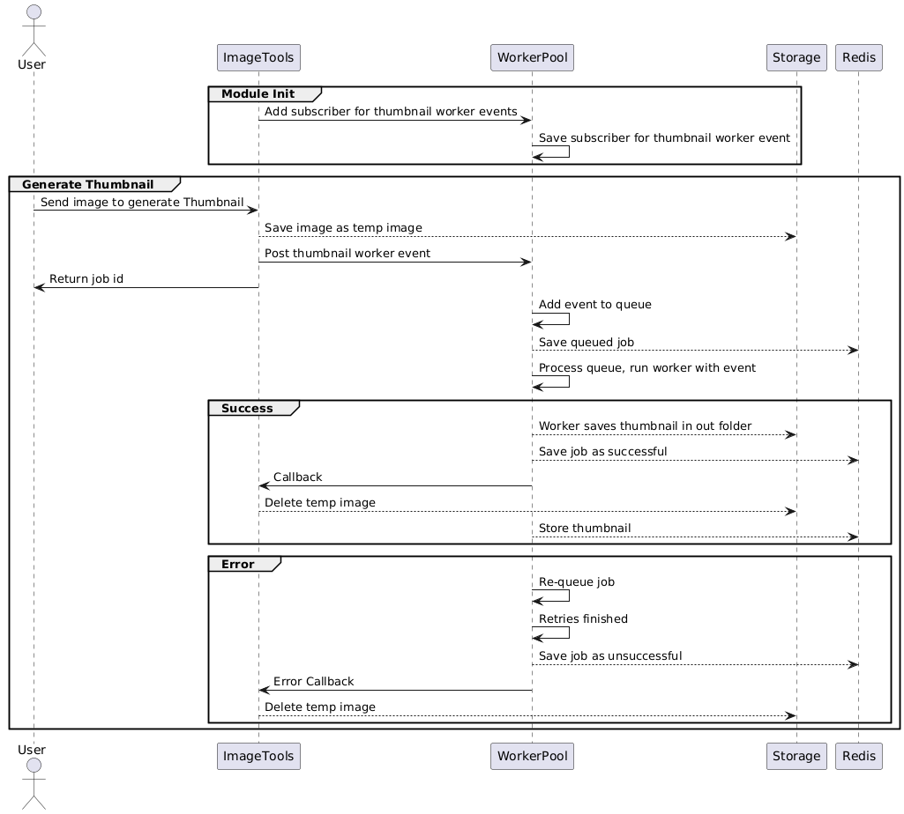

# Image Generation - Ahmad Afiquddin Bin Ahmad

# Table of Contents

- [Background](#background)
- [Getting Started](#getting-started)
  - [Prerequisites](#prerequisites)
  - [Installation](#installation)
  - [Docker Setup](#docker-setup)
    - [Using Docker Compose](#using-docker-compose)
- [Design](#design)
  - [Backend Framework](#backend-framework)
  - [Redis](#redis)
  - [Modules](#modules)
    - [Jobs Module](#jobs-module)
    - [Redis Module](#redis-module)
    - [Storage Module](#storage-module)
    - [Image Tools Module](#image-tools-module)
  - [Flow](#flow)
- [API References](#api-references)
  - [Generate Thumbnails](#generate-thumbnails)
  - [Get Thumbnails](#get-thumbnails)
  - [Get Thumbnail by ID](#get-thumbnail-by-id)
  - [Get Jobs](#get-jobs)
  - [Get Job by ID](#get-job-by-id)
- [Testing](#testing)
  - [Unit Tests](#unit-tests)
  - [E2E Tests](#e2e-tests)
- [Future Improvements](#future-improvements)

## Background

This backend service provides APIs to:

1. Submit an image and generate a thumbnail of size 100 x 100 via a long-running job, returning a job ID
2. Check the status of a long-running job using the job ID
3. Fetch the thumbnail image once processing is complete
4. List all submitted jobs
5. List all thumbnails

## Getting Started

### Prerequisites

- Node.js (v22+)
- npm
- Redis server
- Docker and Docker Compose

### Installation

Install packages by running:

```
npm install
```

Make a copy of .env.example, rename it to .env and fill in the following info:

```
PORT=<Port for nest.js application>
REDIS_HOST=<Redis server host>
REDIS_PORT=<Redis server port>
```

Run in development mode:

```
npm run start:dev
```

Run in production mode:

```
npm run build
npm run start:prod
```

Run unit tests:

```
npm run test
```

Run end-to-end tests:

```
npm run test:e2e
```

### Docker Setup

#### Using Docker Compose

The easiest way to run the application is with Docker Compose:

```
docker compose up
```

This will:

- Build the NestJS application container with all required dependencies
- Start a Redis server
- Connect the services
- Mount necessary volumes for storage

## Design

### Backend Framework

I have decided to use Nest.js as the backend framework of choice since the language requirements are Javascript/Typescript/Python.

#### Pros

1. Modular structure with clear separation of concerns
2. Dependency injection, preventing duplication of instances. It also helps with unit testing as dependencies can be mocked easily.
3. Lifecycle hooks that helps run prep work at service init/application init and cleanup at service/application end.
4. Decorators, pipes, and interceptors that help with verification and response transformation on controllers.

#### Cons

1. A lot of boilerplate code needed for setup, and very structured code that requires time to learn.
2. Performance overhead over minimal express-based service.
3. Complexity for first time users since it is very structured (unless users have used Angular/Java).

The structured style of Nest.js, along with the modular structure and dependency injection helps with reducing redundant service instances, however if I were to build a microservice that just handles the thumbnail generation, I would go with a minimal express service.

### Redis

I decided to use Redis to store jobs and thumbnail details since:

1. It provides fast in-memory storage with optional persistence (no TTL set)
2. It supports hash storage for parent-child relationships
3. It handles concurrent access well for job queue operations

Redis ensures that job states persist across service restarts while providing sub-millisecond operation speeds.

### Modules

#### Jobs Module

Manages job processing with two main components:

1. JobsService: Provides methods to retrieve all jobs and get a job by ID
2. WorkerPool: Manages worker threads, job queueing, and execution

The WorkerPool implements a registry pattern allowing services to:

- Subscribe event types to worker scripts: `subscribe(workerEvent, scriptPath, subscriber, successCallback, errorCallback)`
- Post events for processing: `postEvent(workerEvent)`

#### Redis Module

Provides methods to interact with Redis hash structures:

- Add, update, retrieve, and delete records
- Manage parent-child relationships

#### Storage Module

Handles file operations:

- Temporary file storage during processing
- Permanent storage for finished thumbnails
- File path management and cleanup

#### Image Tools Module

Provides the thumbnail generation functionality:

- Accepts and processes image uploads
- Manages thumbnail creation using the worker pool
- Stores and retrieves thumbnail metadata and files

### Flow



1. Client submits an image to the API
2. API saves the image temporarily and creates a job
3. Worker pool processes the image asynchronously
4. Job status is updated as processing completes
5. Client retrieves thumbnail using the job ID or thumbnail ID

The worker pool handles retries if the job fails.

## API References

### Generate Thumbnails

#### Endpoint: `POST /image-tools/thumbnails`

#### Header

```
Content-Type=multipart/form-data
```

#### Request Body

| Param | Type   | Required           | Description              |
| ----- | ------ | ------------------ | ------------------------ |
| image | File   | :white_check_mark: | Image file to process    |
| sizeX | Number | :x:                | Width (defaults to 100)  |
| sizeY | Number | :x:                | Height (defaults to 100) |

#### Response Data

```
200 OK
jobId
```

#### Example:

```bash
curl -X POST http://localhost:3000/image-tools/thumbnails \
  -H "Content-Type: multipart/form-data" \
  -F "image=@/path/to/image.jpg" \
  -F "sizeX=100" \
  -F "sizeY=100"
```

### Get Thumbnails

Get all processed thumbnails.

#### Endpoint: `GET /image-tools/thumbnails`

#### Response Data

```json
[
  {
    "outputFilePath": "path/to/file",
    "url": "imageUrl"
  }
]
```

#### Example:

```bash
curl -X GET http://localhost:3000/image-tools/thumbnails
```

### Get Thumbnail by ID

Get specific thumbnail by job ID

#### Endpoint: `GET /image-tools/thumbnails/:id`

#### URL Parameters

`id` (string): Job ID

#### Response Data

```json
{
  "outputFilePath": "path/to/file",
  "url": "imageUrl"
}
```

#### Example:

```bash
curl -X GET http://localhost:3000/image-tools/thumbnails/job-id-123456
```

### Get Jobs

Get all jobs.

#### Endpoint: `GET /jobs`

#### Response Data

```json
[
  {
    "id": "job-id-123456";
    "status": "queued" | "processing" | "success" | "failed",
    "event": {
      "id": "job-id-123456",
      "retries": 3,
      "inputFilePath": "/path/to/file",
      "outputFilePath": "/path/to/file",
      "url": "imageUrl",
      "sizeX": 100,
      "sizeY": 100
    },
    "metadata": {
      "err": "message",
    },
  }
]
```

### Get Job by ID

Get specific job by ID.

#### Endpoint: `GET /jobs/:id`

#### URL Parameters

`id` (string): Job ID

#### Response Data

```
{
  "id": "job-id-123456";
  "status": "queued" | "processing" | "success" | "failed",
  "event": {
    "id": "job-id-123456",
    "retries": 3,
    "inputFilePath": "/path/to/file",
    "outputFilePath": "/path/to/file",
    "url": "imageUrl",
    "sizeX": 100,
    "sizeY": 100
  },
  "metadata": {
    "err": "message",
  },
}
```

#### Example:

```bash
curl -X GET http://localhost:3000/jobs/job-id-123456
```

## Testing

Application testing includes unit tests and e2e tests

### Unit Tests

- RedisService: Tests data storage and retrieval operations
- StorageService: Tests file handling and path generation
- JobsService: Tests job retrieval and error handling
- WorkerPool: Tests worker lifecycle management and job processing
- ImageToolsService: Tests thumbnail generation and retrieval

To run:

```bash
npm run test
```

### E2E Tests

- Jobs Controller: Tests job listing and retrieval endpoints
- Image Tools Controller: Tests thumbnail generation and retrieval endpoints

To run:

```bash
npm run test:e2e
```

## Future Improvements

Given more time and resources, there are a few areas that can be improved:

### Production Readiness

1. Cloud Storage Integration: Replace local file storage with S3 for persistence and scalability
2. Database: Move thumbnail data storage to proper database (SQL) for better querying and durability
3. TTL: Implement TTLs and job to prevent accumulation of stale data

### Scalability

1. Microservice: Move worker pool into a separate microservice that can scale independently (worker threads only run in parallel when there is more than 1 CPU core on the server)
2. MQ: Replace worker pool with a queing system like RabbitMQ or SQS

### High Load Management

1. Circuit Breakers: Temporarily block users from adding more resource intensive jobs when server is under load
2. Retry: Retry logic should have exponential backoffs to allow for cooldown on resources
3. Prioritization: Implementing job prioritization that surfaces high-priority jobs to the top of the queue.

### Monitoring

1. Logging: Implement interceptors on responses and errors for better visibility
2. Error Tracing: Include session IDs on logging for better tracing
3. Metrics: Include metrics like processing time on intensive tasks

### Unexpected Issues

1. Redis Goes Down: Implement corrective measures if Redis goes down:

- Error handling, stop accepting new jobs
- Keep active workers running, and cache results in memory

### Bull

Using Bull for processing jobs would be an upgrade to the worker pool system:

1. Enhanced Monitoring: Bull provides more insight as to why jobs fail, and statistics like time taken, etc.
2. Redis Failures: Bull provides and handles backoff reconnections to Redis in case it goes down
3. Retries: Bull provides more flexibility in configuring retry logic
4. Job Data: More granular data

But at the same time:

1. Processing Overhead: More processing for a job
2. Memory Overhead: A Bull job payload is much larger
3. Complexity: Introduces more options, configurations, and patterns
4. Debugging: Compared to a custom solution, trying to debug an issues within Bull's internals
